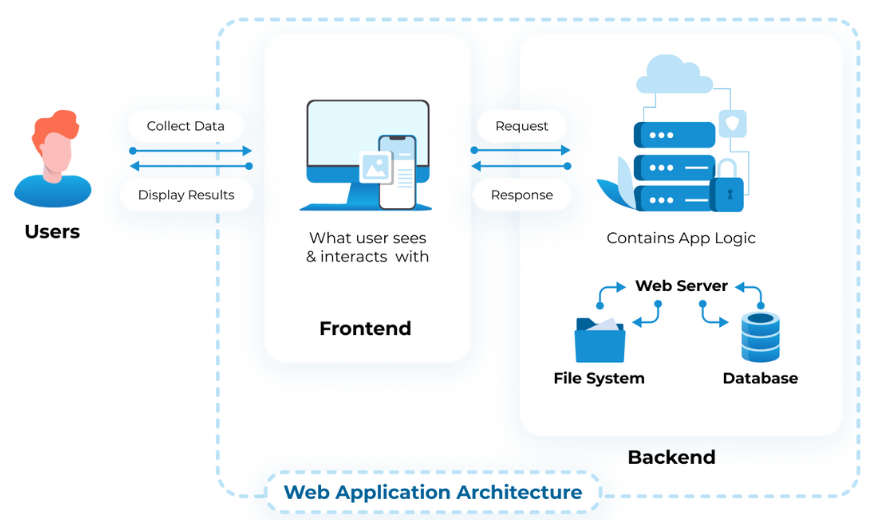
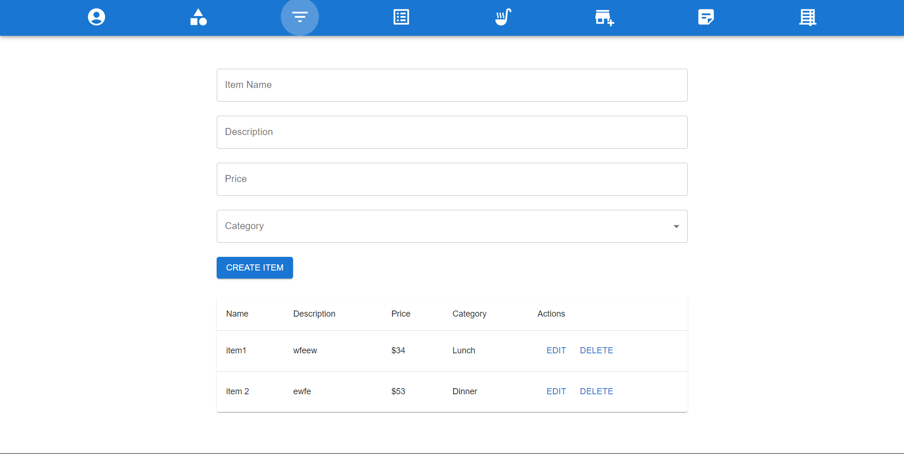
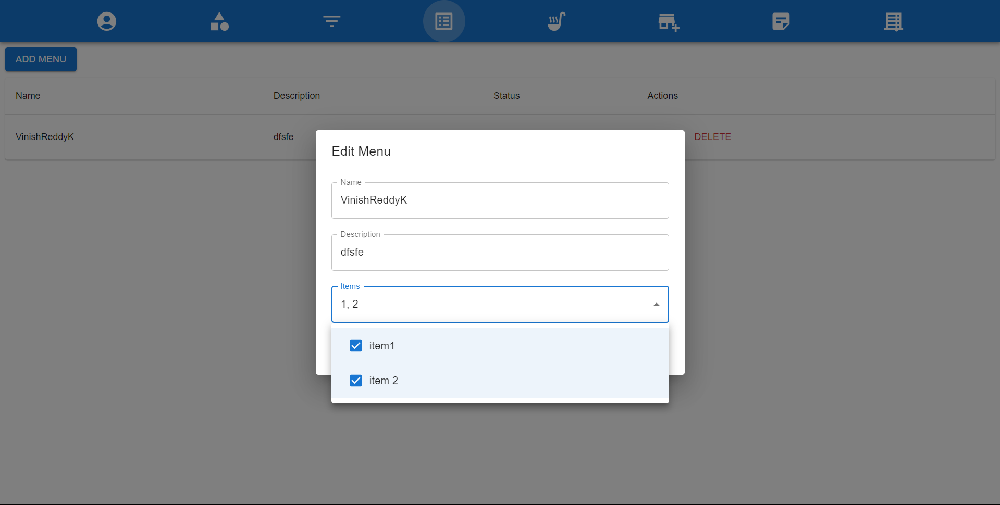
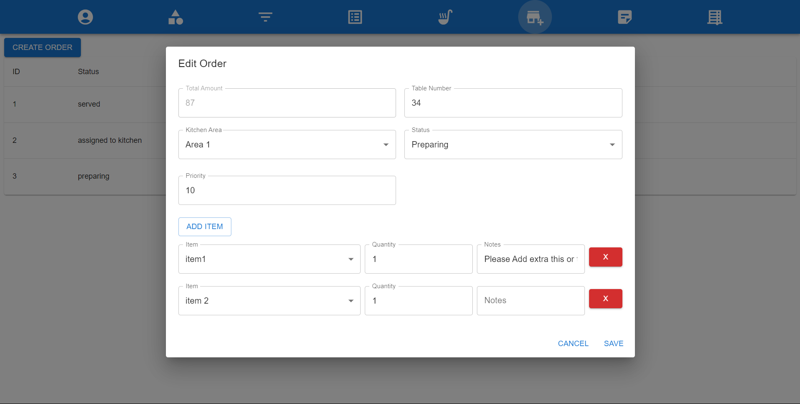
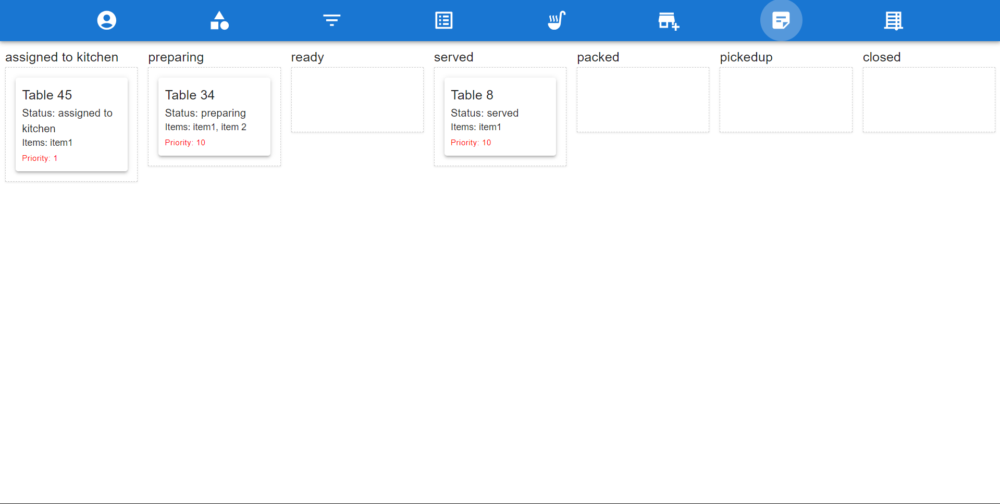

# Introduction

Order Express hub is an app that is developed to take orders and manage them trough different stages effortlessly and easily we can see all the ordrs that are visible all at once in a single display board that are also state managed like if the order is assigned to a particular part of the kitchen it will be going to show up there only. Also its build upon a very efficient and user friendly way from the get go. The below you can find some useful information and also the instructions to install and run the program.

### Architecture diagram



## Order Express Hub Installation

### Prerequisites

- The first thing you will be needing is the npm so to get npm we will first download nod because it will have built in npm in it and it is the only way to install npm effortlessly [download node](https://nodejs.org/en/download)
- After installing the node test for npm using the follwoing command
  ```bash
  npm --version
  ```
- After successfully gettin npm on to the system we then have to install yarn which will build the ui files faster and more efficiently like npm yarn is also a node package manager
  ```bash
  npm install --global yarn
  ```
- The third requirement will be clong the project and getting it onto your system.

  ```bash
  git clone https://github.com/keerthibotlagunta04/Order-Express-Hub-.git
  cd Order-Express-Hub-
  ```

### Run the project

1. Navigate to Order express hub server folder and install the packages and start the server the following commands would be useful for that:
   ```bash
   cd OrderExpressHub-Server
   npm i
   npm start
   ```
2. There is no need start any server for database since we are using sqlite it is a serverless databse which makes it easier to setup so no commands for that are included it is bundled in with ther server.

3. Open a new terminal or command-prompt at the root of the project repository and navigate to order express hub ui folder and run yarn with yarn deployment commands those are listed below:
   ```bash
   cd OrderExpressHub-UI
   yarn
   yarn run dev
   ```
4. You can now access the app if you follow on of the links that appear after running yarn run dev command at the ui files assuming you started the server first. The will usually be localhost running on port 5172 ([http://localhost:5173](http://localhost:5173)) but for reliability follow the link that appears.

## Some important feature screenshots

### Items Module



### Menu Creation



### Order



### Display Board


